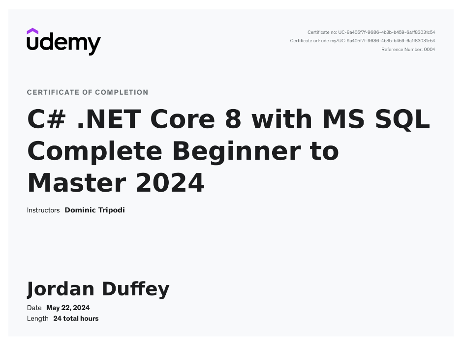

# DotnetAPI Project



## Table of Contents
- [Introduction](#introduction)
- [Features](#features)
- [Technologies Used](#technologies-used)
- [Project Highlights](#project-highlights)
- [API Endpoints](#api-endpoints)
- [Security](#security)
- [Database](#database)
- [Contributing](#contributing)
- [License](#license)

## Introduction
DotnetAPI is a RESTful API built using C# .NET Core, utilizing Dapper for data access and JWT for security. My development up until this point has mainly focused on frontend endeavors, with the most base understanding of API and back end development as a means to an end.  I wanted to correct that gap in knowledge while learning new language and frameworks.  This course was a true deep dive into C# .NET Core with plenty of SQL to give deep backend understanding.  The API features complex SQL queries and stored procedures for efficient data handling. It was initially deployed on Azure but is now configured for local development to avoid unnecessary costs.

## Features
- Secure authentication using JWT and Microsoft's token identity model.
- Data access through Dapper.
- Configured for both development and production environments.
- Comprehensive API documentation with Swagger.

## Technologies Used
- **C# .NET Core**
- **Dapper**
- **Azure Data Studio**
- **SQL Server** (with complex queries and stored procedures)
- **JWT (JSON Web Tokens)**
- **Swagger for API documentation**
- **AutoMapper**
- **Microsoft IdentityModel Tokens**
- **ASP.NET Core MVC**

## Project Highlights
This project demonstrates the use of various advanced technologies and methodologies, including:

- **Stored Procedures and Complex Queries**: The project utilizes SQL Server stored procedures for efficient data operations, including user management, post management, and authentication.
- **Clustered and Non-Clustered Indexes**: Implemented to optimize query performance.
- **JWT Security**: Secure authentication and authorization using JWT.
- **Dapper**: Lightweight ORM for efficient data access.
- **CORS Policy**: Configured for both development and production environments.

## API Endpoints
### Auth
- **POST /Auth/Register**: Register a new user.
- **PUT /Auth/ResetPassword**: Reset a user's password.
- **POST /Auth/Login**: User login.
- **GET /Auth/RefreshToken**: Refresh the authentication token.

### Post
- **GET /Post/Posts/{postId}/{userId}/{searchValue}**: Get posts based on post ID, user ID, and search value, with default values of 0, 0, and none returning all posts.
- **GET /Post/MyPosts**: Get the current user's posts.
- **PUT /Post/UpsertPost**: Insert or update a post.
- **DELETE /Post/Post/{postId}**: Delete a post by post ID.

### Test
- **GET /Test/Connect**: Test connection.
- **GET /Test**: General test endpoint.

### UserComplete
- **GET /UserComplete/TestConnect**: Test connection for UserComplete.
- **GET /UserComplete/GetUsers/{userId}/{active}**: Get users based on user ID and active status.
- **PUT /UserComplete/UpsertUser**: Insert or update a user.
- **DELETE /UserComplete/DeleteUser/{userId}**: Delete a user by user ID.

## Security
The API uses JWT for authentication and authorization. The token is generated and validated using Microsoft's IdentityModel tokens. Ensure the `PasswordKey` and `TokenKey` in `appsettings.json` are securely managed.

#### Security Configuration in `Program.cs`
```csharp
string? tokenKeyString = builder.Configuration.GetSection("AppSettings:TokenKey").Value;
SymmetricSecurityKey tokenKey = new SymmetricSecurityKey(
    Encoding.UTF8.GetBytes(
        tokenKeyString != null ? tokenKeyString : ""
    )
);

string? tokenKeyString = builder.Configuration.GetSection("AppSettings:TokenKey").Value;

SymmetricSecurityKey tokenKey = new SymmetricSecurityKey(
    Encoding.UTF8.GetBytes(
        tokenKeyString != null ? tokenKeyString : ""
    )
);

TokenValidationParameters tokenValidationParameters = new TokenValidationParameters()
{
    IssuerSigningKey = tokenKey,
    ValidateIssuer = false,
    ValidateIssuerSigningKey = false,
    ValidateAudience = false
};

builder.Services.AddAuthentication(JwtBearerDefaults.AuthenticationScheme)
    .AddJwtBearer(options => 
    {
        options.TokenValidationParameters = tokenValidationParameters;
    });
```

### Password and Token Management
See the security setup and configuration in `Program.cs` and in the helpers folder where the passwords are created for the database.

## Database
The database schema includes multiple tables and stored procedures to manage user data, authentication, and posts. Below is an example of table creation:

### Example Table Creation
```sql
CREATE TABLE Users (
    UserId INT PRIMARY KEY IDENTITY(1,1),
    FirstName NVARCHAR(50),
    LastName NVARCHAR(50),
    Email NVARCHAR(50),
    Gender NVARCHAR(50),
    Active BIT
);
```

### Example Index Creation
```sql
CREATE NONCLUSTERED INDEX fix_Users_Active
    ON Users (Active)
    INCLUDE (Email, FirstName, LastName, Gender)
    WHERE active = 1;
```

### Example of Complex Stored Procedure
```sql
CREATE OR ALTER PROCEDURE TutorialAppSchema.spUsers_Get
    @UserId INT = NULL,
    @Active BIT = NULL
AS
BEGIN
    SELECT [Users].[UserId],
           [Users].[FirstName],
           [Users].[LastName],
           [Users].[Email],
           [Users].[Gender],
           [Users].[Active],
           UserSalary.Salary,
           UserJobInfo.Department,
           UserJobInfo.JobTitle,
           AvgSalary.AvgSalary
    FROM TutorialAppSchema.Users AS Users 
    LEFT JOIN TutorialAppSchema.UserSalary AS UserSalary ON UserSalary.UserId = Users.UserId
    LEFT JOIN TutorialAppSchema.UserJobInfo AS UserJobInfo ON UserJobInfo.UserId = Users.UserId
    LEFT JOIN #AverageDeptSalary AS AvgSalary ON AvgSalary.Department = UserJobInfo.Department
    WHERE Users.UserId = ISNULL(@UserId, Users.UserId)
      AND ISNULL(Users.Active, 0) = COALESCE(@Active, Users.Active, 0);
END;
GO
```

## Contributing
Contributions are welcome! Please open an issue or submit a pull request.

## License
This project is licensed under the MIT License. See the [LICENSE](LICENSE) file for details.

